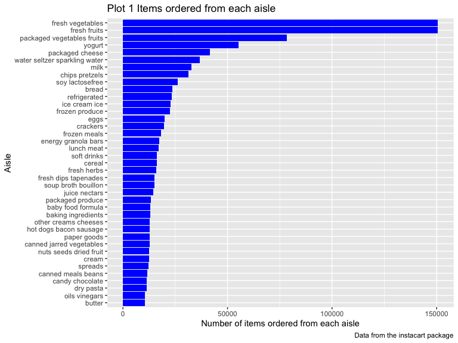
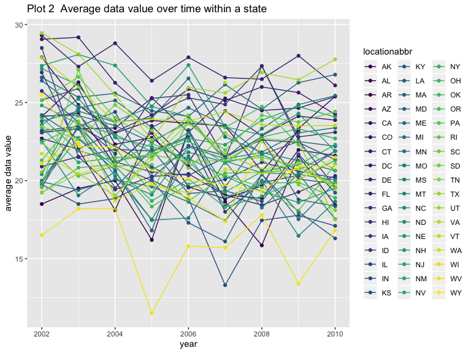
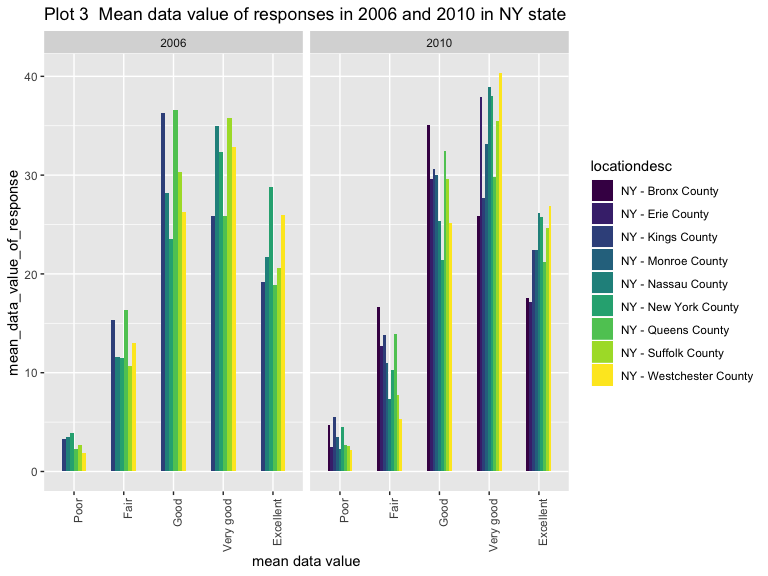
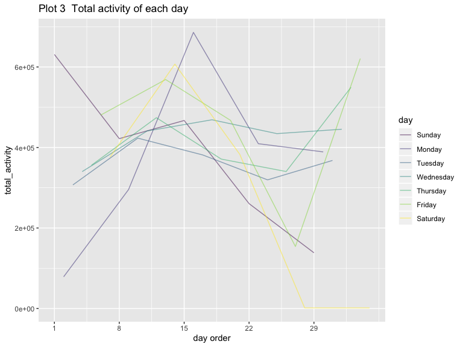
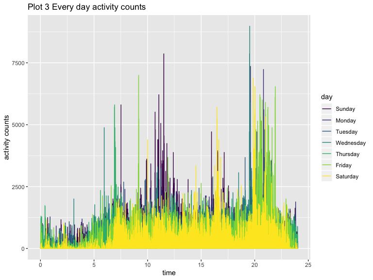

p8105\_hw3\_xw2676.Rmd
================

## Problem1

``` r
library(p8105.datasets)
data("instacart") 
instacart %>% 
  head(8) %>% 
  knitr::kable(format = "html", caption = "Table 1 An example from the dataset")
```

<table>

<caption>

Table 1 An example from the dataset

</caption>

<thead>

<tr>

<th style="text-align:right;">

order\_id

</th>

<th style="text-align:right;">

product\_id

</th>

<th style="text-align:right;">

add\_to\_cart\_order

</th>

<th style="text-align:right;">

reordered

</th>

<th style="text-align:right;">

user\_id

</th>

<th style="text-align:left;">

eval\_set

</th>

<th style="text-align:right;">

order\_number

</th>

<th style="text-align:right;">

order\_dow

</th>

<th style="text-align:right;">

order\_hour\_of\_day

</th>

<th style="text-align:right;">

days\_since\_prior\_order

</th>

<th style="text-align:left;">

product\_name

</th>

<th style="text-align:right;">

aisle\_id

</th>

<th style="text-align:right;">

department\_id

</th>

<th style="text-align:left;">

aisle

</th>

<th style="text-align:left;">

department

</th>

</tr>

</thead>

<tbody>

<tr>

<td style="text-align:right;">

1

</td>

<td style="text-align:right;">

49302

</td>

<td style="text-align:right;">

1

</td>

<td style="text-align:right;">

1

</td>

<td style="text-align:right;">

112108

</td>

<td style="text-align:left;">

train

</td>

<td style="text-align:right;">

4

</td>

<td style="text-align:right;">

4

</td>

<td style="text-align:right;">

10

</td>

<td style="text-align:right;">

9

</td>

<td style="text-align:left;">

Bulgarian Yogurt

</td>

<td style="text-align:right;">

120

</td>

<td style="text-align:right;">

16

</td>

<td style="text-align:left;">

yogurt

</td>

<td style="text-align:left;">

dairy eggs

</td>

</tr>

<tr>

<td style="text-align:right;">

1

</td>

<td style="text-align:right;">

11109

</td>

<td style="text-align:right;">

2

</td>

<td style="text-align:right;">

1

</td>

<td style="text-align:right;">

112108

</td>

<td style="text-align:left;">

train

</td>

<td style="text-align:right;">

4

</td>

<td style="text-align:right;">

4

</td>

<td style="text-align:right;">

10

</td>

<td style="text-align:right;">

9

</td>

<td style="text-align:left;">

Organic 4% Milk Fat Whole Milk Cottage Cheese

</td>

<td style="text-align:right;">

108

</td>

<td style="text-align:right;">

16

</td>

<td style="text-align:left;">

other creams cheeses

</td>

<td style="text-align:left;">

dairy eggs

</td>

</tr>

<tr>

<td style="text-align:right;">

1

</td>

<td style="text-align:right;">

10246

</td>

<td style="text-align:right;">

3

</td>

<td style="text-align:right;">

0

</td>

<td style="text-align:right;">

112108

</td>

<td style="text-align:left;">

train

</td>

<td style="text-align:right;">

4

</td>

<td style="text-align:right;">

4

</td>

<td style="text-align:right;">

10

</td>

<td style="text-align:right;">

9

</td>

<td style="text-align:left;">

Organic Celery Hearts

</td>

<td style="text-align:right;">

83

</td>

<td style="text-align:right;">

4

</td>

<td style="text-align:left;">

fresh vegetables

</td>

<td style="text-align:left;">

produce

</td>

</tr>

<tr>

<td style="text-align:right;">

1

</td>

<td style="text-align:right;">

49683

</td>

<td style="text-align:right;">

4

</td>

<td style="text-align:right;">

0

</td>

<td style="text-align:right;">

112108

</td>

<td style="text-align:left;">

train

</td>

<td style="text-align:right;">

4

</td>

<td style="text-align:right;">

4

</td>

<td style="text-align:right;">

10

</td>

<td style="text-align:right;">

9

</td>

<td style="text-align:left;">

Cucumber Kirby

</td>

<td style="text-align:right;">

83

</td>

<td style="text-align:right;">

4

</td>

<td style="text-align:left;">

fresh vegetables

</td>

<td style="text-align:left;">

produce

</td>

</tr>

<tr>

<td style="text-align:right;">

1

</td>

<td style="text-align:right;">

43633

</td>

<td style="text-align:right;">

5

</td>

<td style="text-align:right;">

1

</td>

<td style="text-align:right;">

112108

</td>

<td style="text-align:left;">

train

</td>

<td style="text-align:right;">

4

</td>

<td style="text-align:right;">

4

</td>

<td style="text-align:right;">

10

</td>

<td style="text-align:right;">

9

</td>

<td style="text-align:left;">

Lightly Smoked Sardines in Olive Oil

</td>

<td style="text-align:right;">

95

</td>

<td style="text-align:right;">

15

</td>

<td style="text-align:left;">

canned meat seafood

</td>

<td style="text-align:left;">

canned goods

</td>

</tr>

<tr>

<td style="text-align:right;">

1

</td>

<td style="text-align:right;">

13176

</td>

<td style="text-align:right;">

6

</td>

<td style="text-align:right;">

0

</td>

<td style="text-align:right;">

112108

</td>

<td style="text-align:left;">

train

</td>

<td style="text-align:right;">

4

</td>

<td style="text-align:right;">

4

</td>

<td style="text-align:right;">

10

</td>

<td style="text-align:right;">

9

</td>

<td style="text-align:left;">

Bag of Organic Bananas

</td>

<td style="text-align:right;">

24

</td>

<td style="text-align:right;">

4

</td>

<td style="text-align:left;">

fresh fruits

</td>

<td style="text-align:left;">

produce

</td>

</tr>

<tr>

<td style="text-align:right;">

1

</td>

<td style="text-align:right;">

47209

</td>

<td style="text-align:right;">

7

</td>

<td style="text-align:right;">

0

</td>

<td style="text-align:right;">

112108

</td>

<td style="text-align:left;">

train

</td>

<td style="text-align:right;">

4

</td>

<td style="text-align:right;">

4

</td>

<td style="text-align:right;">

10

</td>

<td style="text-align:right;">

9

</td>

<td style="text-align:left;">

Organic Hass Avocado

</td>

<td style="text-align:right;">

24

</td>

<td style="text-align:right;">

4

</td>

<td style="text-align:left;">

fresh fruits

</td>

<td style="text-align:left;">

produce

</td>

</tr>

<tr>

<td style="text-align:right;">

1

</td>

<td style="text-align:right;">

22035

</td>

<td style="text-align:right;">

8

</td>

<td style="text-align:right;">

1

</td>

<td style="text-align:right;">

112108

</td>

<td style="text-align:left;">

train

</td>

<td style="text-align:right;">

4

</td>

<td style="text-align:right;">

4

</td>

<td style="text-align:right;">

10

</td>

<td style="text-align:right;">

9

</td>

<td style="text-align:left;">

Organic Whole String Cheese

</td>

<td style="text-align:right;">

21

</td>

<td style="text-align:right;">

16

</td>

<td style="text-align:left;">

packaged cheese

</td>

<td style="text-align:left;">

dairy eggs

</td>

</tr>

</tbody>

</table>

There are 1384617 observations and 15 variables in instacart dataset.
The key variables are order\_id，product\_id, order\_dow,
order\_hour\_of\_day, product\_name,
aisle\_id,department\_id,aisle,department. For example, there is a
customer whose id is 112108 bought an order whose id is 1 in 10:00 am
Thursday. Among these products, such as yogurt or cheese, there are 4
products that he have bought before. And this order is his fourth order.
It has been 9 days ever since his prior
order.

#### 1）

``` r
aisle_data_ordered = group_by(instacart,aisle,aisle_id) %>% ## split data into datasets of different aisles
  summarise(n = n()) %>% ## generate a dataset which comprises of every aisle and number of items ordered from it.
  arrange(-n) 
max_aisle = head(aisle_data_ordered,1)
knitr::kable(aisle_data_ordered, format = "html",caption = "Table 2 Numbers of items bought from each aisle")
```

<table>

<caption>

Table 2 Numbers of items bought from each aisle

</caption>

<thead>

<tr>

<th style="text-align:left;">

aisle

</th>

<th style="text-align:right;">

aisle\_id

</th>

<th style="text-align:right;">

n

</th>

</tr>

</thead>

<tbody>

<tr>

<td style="text-align:left;">

fresh vegetables

</td>

<td style="text-align:right;">

83

</td>

<td style="text-align:right;">

150609

</td>

</tr>

<tr>

<td style="text-align:left;">

fresh fruits

</td>

<td style="text-align:right;">

24

</td>

<td style="text-align:right;">

150473

</td>

</tr>

<tr>

<td style="text-align:left;">

packaged vegetables fruits

</td>

<td style="text-align:right;">

123

</td>

<td style="text-align:right;">

78493

</td>

</tr>

<tr>

<td style="text-align:left;">

yogurt

</td>

<td style="text-align:right;">

120

</td>

<td style="text-align:right;">

55240

</td>

</tr>

<tr>

<td style="text-align:left;">

packaged cheese

</td>

<td style="text-align:right;">

21

</td>

<td style="text-align:right;">

41699

</td>

</tr>

<tr>

<td style="text-align:left;">

water seltzer sparkling water

</td>

<td style="text-align:right;">

115

</td>

<td style="text-align:right;">

36617

</td>

</tr>

<tr>

<td style="text-align:left;">

milk

</td>

<td style="text-align:right;">

84

</td>

<td style="text-align:right;">

32644

</td>

</tr>

<tr>

<td style="text-align:left;">

chips pretzels

</td>

<td style="text-align:right;">

107

</td>

<td style="text-align:right;">

31269

</td>

</tr>

<tr>

<td style="text-align:left;">

soy lactosefree

</td>

<td style="text-align:right;">

91

</td>

<td style="text-align:right;">

26240

</td>

</tr>

<tr>

<td style="text-align:left;">

bread

</td>

<td style="text-align:right;">

112

</td>

<td style="text-align:right;">

23635

</td>

</tr>

<tr>

<td style="text-align:left;">

refrigerated

</td>

<td style="text-align:right;">

31

</td>

<td style="text-align:right;">

23228

</td>

</tr>

<tr>

<td style="text-align:left;">

ice cream ice

</td>

<td style="text-align:right;">

37

</td>

<td style="text-align:right;">

22676

</td>

</tr>

<tr>

<td style="text-align:left;">

frozen produce

</td>

<td style="text-align:right;">

116

</td>

<td style="text-align:right;">

22453

</td>

</tr>

<tr>

<td style="text-align:left;">

eggs

</td>

<td style="text-align:right;">

86

</td>

<td style="text-align:right;">

19875

</td>

</tr>

<tr>

<td style="text-align:left;">

crackers

</td>

<td style="text-align:right;">

78

</td>

<td style="text-align:right;">

19592

</td>

</tr>

<tr>

<td style="text-align:left;">

frozen meals

</td>

<td style="text-align:right;">

38

</td>

<td style="text-align:right;">

18221

</td>

</tr>

<tr>

<td style="text-align:left;">

energy granola bars

</td>

<td style="text-align:right;">

3

</td>

<td style="text-align:right;">

17449

</td>

</tr>

<tr>

<td style="text-align:left;">

lunch meat

</td>

<td style="text-align:right;">

96

</td>

<td style="text-align:right;">

16957

</td>

</tr>

<tr>

<td style="text-align:left;">

soft drinks

</td>

<td style="text-align:right;">

77

</td>

<td style="text-align:right;">

16279

</td>

</tr>

<tr>

<td style="text-align:left;">

cereal

</td>

<td style="text-align:right;">

121

</td>

<td style="text-align:right;">

16201

</td>

</tr>

<tr>

<td style="text-align:left;">

fresh herbs

</td>

<td style="text-align:right;">

16

</td>

<td style="text-align:right;">

16052

</td>

</tr>

<tr>

<td style="text-align:left;">

fresh dips tapenades

</td>

<td style="text-align:right;">

67

</td>

<td style="text-align:right;">

15142

</td>

</tr>

<tr>

<td style="text-align:left;">

soup broth bouillon

</td>

<td style="text-align:right;">

69

</td>

<td style="text-align:right;">

15109

</td>

</tr>

<tr>

<td style="text-align:left;">

juice nectars

</td>

<td style="text-align:right;">

98

</td>

<td style="text-align:right;">

14350

</td>

</tr>

<tr>

<td style="text-align:left;">

packaged produce

</td>

<td style="text-align:right;">

32

</td>

<td style="text-align:right;">

13460

</td>

</tr>

<tr>

<td style="text-align:left;">

baby food formula

</td>

<td style="text-align:right;">

92

</td>

<td style="text-align:right;">

13198

</td>

</tr>

<tr>

<td style="text-align:left;">

baking ingredients

</td>

<td style="text-align:right;">

17

</td>

<td style="text-align:right;">

13088

</td>

</tr>

<tr>

<td style="text-align:left;">

other creams cheeses

</td>

<td style="text-align:right;">

108

</td>

<td style="text-align:right;">

12820

</td>

</tr>

<tr>

<td style="text-align:left;">

hot dogs bacon sausage

</td>

<td style="text-align:right;">

106

</td>

<td style="text-align:right;">

12813

</td>

</tr>

<tr>

<td style="text-align:left;">

paper goods

</td>

<td style="text-align:right;">

54

</td>

<td style="text-align:right;">

12694

</td>

</tr>

<tr>

<td style="text-align:left;">

canned jarred vegetables

</td>

<td style="text-align:right;">

81

</td>

<td style="text-align:right;">

12679

</td>

</tr>

<tr>

<td style="text-align:left;">

nuts seeds dried fruit

</td>

<td style="text-align:right;">

117

</td>

<td style="text-align:right;">

12532

</td>

</tr>

<tr>

<td style="text-align:left;">

cream

</td>

<td style="text-align:right;">

53

</td>

<td style="text-align:right;">

12356

</td>

</tr>

<tr>

<td style="text-align:left;">

spreads

</td>

<td style="text-align:right;">

88

</td>

<td style="text-align:right;">

12102

</td>

</tr>

<tr>

<td style="text-align:left;">

canned meals beans

</td>

<td style="text-align:right;">

59

</td>

<td style="text-align:right;">

11774

</td>

</tr>

<tr>

<td style="text-align:left;">

candy chocolate

</td>

<td style="text-align:right;">

45

</td>

<td style="text-align:right;">

11453

</td>

</tr>

<tr>

<td style="text-align:left;">

dry pasta

</td>

<td style="text-align:right;">

131

</td>

<td style="text-align:right;">

11298

</td>

</tr>

<tr>

<td style="text-align:left;">

oils vinegars

</td>

<td style="text-align:right;">

19

</td>

<td style="text-align:right;">

10620

</td>

</tr>

<tr>

<td style="text-align:left;">

butter

</td>

<td style="text-align:right;">

36

</td>

<td style="text-align:right;">

10575

</td>

</tr>

<tr>

<td style="text-align:left;">

cookies cakes

</td>

<td style="text-align:right;">

61

</td>

<td style="text-align:right;">

9980

</td>

</tr>

<tr>

<td style="text-align:left;">

instant foods

</td>

<td style="text-align:right;">

4

</td>

<td style="text-align:right;">

9917

</td>

</tr>

<tr>

<td style="text-align:left;">

breakfast bakery

</td>

<td style="text-align:right;">

93

</td>

<td style="text-align:right;">

9851

</td>

</tr>

<tr>

<td style="text-align:left;">

condiments

</td>

<td style="text-align:right;">

72

</td>

<td style="text-align:right;">

9743

</td>

</tr>

<tr>

<td style="text-align:left;">

pasta sauce

</td>

<td style="text-align:right;">

9

</td>

<td style="text-align:right;">

9736

</td>

</tr>

<tr>

<td style="text-align:left;">

frozen breakfast

</td>

<td style="text-align:right;">

52

</td>

<td style="text-align:right;">

9729

</td>

</tr>

<tr>

<td style="text-align:left;">

tea

</td>

<td style="text-align:right;">

94

</td>

<td style="text-align:right;">

9376

</td>

</tr>

<tr>

<td style="text-align:left;">

spices seasonings

</td>

<td style="text-align:right;">

104

</td>

<td style="text-align:right;">

9279

</td>

</tr>

<tr>

<td style="text-align:left;">

frozen appetizers sides

</td>

<td style="text-align:right;">

129

</td>

<td style="text-align:right;">

8870

</td>

</tr>

<tr>

<td style="text-align:left;">

coffee

</td>

<td style="text-align:right;">

26

</td>

<td style="text-align:right;">

8392

</td>

</tr>

<tr>

<td style="text-align:left;">

tortillas flat bread

</td>

<td style="text-align:right;">

128

</td>

<td style="text-align:right;">

8353

</td>

</tr>

<tr>

<td style="text-align:left;">

missing

</td>

<td style="text-align:right;">

100

</td>

<td style="text-align:right;">

8251

</td>

</tr>

<tr>

<td style="text-align:left;">

frozen pizza

</td>

<td style="text-align:right;">

79

</td>

<td style="text-align:right;">

7661

</td>

</tr>

<tr>

<td style="text-align:left;">

asian foods

</td>

<td style="text-align:right;">

66

</td>

<td style="text-align:right;">

7007

</td>

</tr>

<tr>

<td style="text-align:left;">

popcorn jerky

</td>

<td style="text-align:right;">

23

</td>

<td style="text-align:right;">

6917

</td>

</tr>

<tr>

<td style="text-align:left;">

fruit vegetable snacks

</td>

<td style="text-align:right;">

50

</td>

<td style="text-align:right;">

6741

</td>

</tr>

<tr>

<td style="text-align:left;">

hot cereal pancake mixes

</td>

<td style="text-align:right;">

130

</td>

<td style="text-align:right;">

6352

</td>

</tr>

<tr>

<td style="text-align:left;">

grains rice dried goods

</td>

<td style="text-align:right;">

63

</td>

<td style="text-align:right;">

6134

</td>

</tr>

<tr>

<td style="text-align:left;">

cleaning products

</td>

<td style="text-align:right;">

114

</td>

<td style="text-align:right;">

5894

</td>

</tr>

<tr>

<td style="text-align:left;">

packaged poultry

</td>

<td style="text-align:right;">

49

</td>

<td style="text-align:right;">

5608

</td>

</tr>

<tr>

<td style="text-align:left;">

poultry counter

</td>

<td style="text-align:right;">

35

</td>

<td style="text-align:right;">

5208

</td>

</tr>

<tr>

<td style="text-align:left;">

preserved dips spreads

</td>

<td style="text-align:right;">

51

</td>

<td style="text-align:right;">

5188

</td>

</tr>

<tr>

<td style="text-align:left;">

tofu meat alternatives

</td>

<td style="text-align:right;">

14

</td>

<td style="text-align:right;">

5123

</td>

</tr>

<tr>

<td style="text-align:left;">

buns rolls

</td>

<td style="text-align:right;">

43

</td>

<td style="text-align:right;">

5054

</td>

</tr>

<tr>

<td style="text-align:left;">

pickled goods olives

</td>

<td style="text-align:right;">

110

</td>

<td style="text-align:right;">

4882

</td>

</tr>

<tr>

<td style="text-align:left;">

doughs gelatins bake mixes

</td>

<td style="text-align:right;">

105

</td>

<td style="text-align:right;">

4758

</td>

</tr>

<tr>

<td style="text-align:left;">

energy sports drinks

</td>

<td style="text-align:right;">

64

</td>

<td style="text-align:right;">

4742

</td>

</tr>

<tr>

<td style="text-align:left;">

frozen vegan vegetarian

</td>

<td style="text-align:right;">

42

</td>

<td style="text-align:right;">

4727

</td>

</tr>

<tr>

<td style="text-align:left;">

salad dressing toppings

</td>

<td style="text-align:right;">

89

</td>

<td style="text-align:right;">

4719

</td>

</tr>

<tr>

<td style="text-align:left;">

laundry

</td>

<td style="text-align:right;">

75

</td>

<td style="text-align:right;">

4636

</td>

</tr>

<tr>

<td style="text-align:left;">

prepared meals

</td>

<td style="text-align:right;">

13

</td>

<td style="text-align:right;">

4133

</td>

</tr>

<tr>

<td style="text-align:left;">

canned fruit applesauce

</td>

<td style="text-align:right;">

99

</td>

<td style="text-align:right;">

3996

</td>

</tr>

<tr>

<td style="text-align:left;">

specialty cheeses

</td>

<td style="text-align:right;">

2

</td>

<td style="text-align:right;">

3873

</td>

</tr>

<tr>

<td style="text-align:left;">

dish detergents

</td>

<td style="text-align:right;">

74

</td>

<td style="text-align:right;">

3870

</td>

</tr>

<tr>

<td style="text-align:left;">

granola

</td>

<td style="text-align:right;">

57

</td>

<td style="text-align:right;">

3803

</td>

</tr>

<tr>

<td style="text-align:left;">

latino foods

</td>

<td style="text-align:right;">

30

</td>

<td style="text-align:right;">

3548

</td>

</tr>

<tr>

<td style="text-align:left;">

frozen meat seafood

</td>

<td style="text-align:right;">

34

</td>

<td style="text-align:right;">

3341

</td>

</tr>

<tr>

<td style="text-align:left;">

canned meat seafood

</td>

<td style="text-align:right;">

95

</td>

<td style="text-align:right;">

3241

</td>

</tr>

<tr>

<td style="text-align:left;">

meat counter

</td>

<td style="text-align:right;">

122

</td>

<td style="text-align:right;">

3159

</td>

</tr>

<tr>

<td style="text-align:left;">

breakfast bars pastries

</td>

<td style="text-align:right;">

48

</td>

<td style="text-align:right;">

3144

</td>

</tr>

<tr>

<td style="text-align:left;">

oral hygiene

</td>

<td style="text-align:right;">

20

</td>

<td style="text-align:right;">

3070

</td>

</tr>

<tr>

<td style="text-align:left;">

prepared soups salads

</td>

<td style="text-align:right;">

1

</td>

<td style="text-align:right;">

2936

</td>

</tr>

<tr>

<td style="text-align:left;">

food storage

</td>

<td style="text-align:right;">

85

</td>

<td style="text-align:right;">

2906

</td>

</tr>

<tr>

<td style="text-align:left;">

marinades meat preparation

</td>

<td style="text-align:right;">

5

</td>

<td style="text-align:right;">

2905

</td>

</tr>

<tr>

<td style="text-align:left;">

cat food care

</td>

<td style="text-align:right;">

41

</td>

<td style="text-align:right;">

2885

</td>

</tr>

<tr>

<td style="text-align:left;">

honeys syrups nectars

</td>

<td style="text-align:right;">

29

</td>

<td style="text-align:right;">

2864

</td>

</tr>

<tr>

<td style="text-align:left;">

soap

</td>

<td style="text-align:right;">

25

</td>

<td style="text-align:right;">

2773

</td>

</tr>

<tr>

<td style="text-align:left;">

body lotions soap

</td>

<td style="text-align:right;">

127

</td>

<td style="text-align:right;">

2137

</td>

</tr>

<tr>

<td style="text-align:left;">

vitamins supplements

</td>

<td style="text-align:right;">

47

</td>

<td style="text-align:right;">

1969

</td>

</tr>

<tr>

<td style="text-align:left;">

plates bowls cups flatware

</td>

<td style="text-align:right;">

111

</td>

<td style="text-align:right;">

1959

</td>

</tr>

<tr>

<td style="text-align:left;">

beers coolers

</td>

<td style="text-align:right;">

27

</td>

<td style="text-align:right;">

1839

</td>

</tr>

<tr>

<td style="text-align:left;">

other

</td>

<td style="text-align:right;">

6

</td>

<td style="text-align:right;">

1795

</td>

</tr>

<tr>

<td style="text-align:left;">

refrigerated pudding desserts

</td>

<td style="text-align:right;">

71

</td>

<td style="text-align:right;">

1729

</td>

</tr>

<tr>

<td style="text-align:left;">

fresh pasta

</td>

<td style="text-align:right;">

12

</td>

<td style="text-align:right;">

1628

</td>

</tr>

<tr>

<td style="text-align:left;">

trash bags liners

</td>

<td style="text-align:right;">

60

</td>

<td style="text-align:right;">

1621

</td>

</tr>

<tr>

<td style="text-align:left;">

dog food care

</td>

<td style="text-align:right;">

40

</td>

<td style="text-align:right;">

1612

</td>

</tr>

<tr>

<td style="text-align:left;">

protein meal replacements

</td>

<td style="text-align:right;">

65

</td>

<td style="text-align:right;">

1612

</td>

</tr>

<tr>

<td style="text-align:left;">

frozen breads doughs

</td>

<td style="text-align:right;">

58

</td>

<td style="text-align:right;">

1532

</td>

</tr>

<tr>

<td style="text-align:left;">

packaged meat

</td>

<td style="text-align:right;">

7

</td>

<td style="text-align:right;">

1526

</td>

</tr>

<tr>

<td style="text-align:left;">

bakery desserts

</td>

<td style="text-align:right;">

8

</td>

<td style="text-align:right;">

1501

</td>

</tr>

<tr>

<td style="text-align:left;">

hair care

</td>

<td style="text-align:right;">

22

</td>

<td style="text-align:right;">

1469

</td>

</tr>

<tr>

<td style="text-align:left;">

trail mix snack mix

</td>

<td style="text-align:right;">

125

</td>

<td style="text-align:right;">

1463

</td>

</tr>

<tr>

<td style="text-align:left;">

cold flu allergy

</td>

<td style="text-align:right;">

11

</td>

<td style="text-align:right;">

1346

</td>

</tr>

<tr>

<td style="text-align:left;">

red wines

</td>

<td style="text-align:right;">

28

</td>

<td style="text-align:right;">

1243

</td>

</tr>

<tr>

<td style="text-align:left;">

digestion

</td>

<td style="text-align:right;">

70

</td>

<td style="text-align:right;">

1205

</td>

</tr>

<tr>

<td style="text-align:left;">

diapers wipes

</td>

<td style="text-align:right;">

56

</td>

<td style="text-align:right;">

1109

</td>

</tr>

<tr>

<td style="text-align:left;">

baking supplies decor

</td>

<td style="text-align:right;">

97

</td>

<td style="text-align:right;">

1094

</td>

</tr>

<tr>

<td style="text-align:left;">

white wines

</td>

<td style="text-align:right;">

62

</td>

<td style="text-align:right;">

1088

</td>

</tr>

<tr>

<td style="text-align:left;">

seafood counter

</td>

<td style="text-align:right;">

39

</td>

<td style="text-align:right;">

1084

</td>

</tr>

<tr>

<td style="text-align:left;">

air fresheners candles

</td>

<td style="text-align:right;">

101

</td>

<td style="text-align:right;">

1067

</td>

</tr>

<tr>

<td style="text-align:left;">

cocoa drink mixes

</td>

<td style="text-align:right;">

90

</td>

<td style="text-align:right;">

1062

</td>

</tr>

<tr>

<td style="text-align:left;">

feminine care

</td>

<td style="text-align:right;">

126

</td>

<td style="text-align:right;">

1048

</td>

</tr>

<tr>

<td style="text-align:left;">

spirits

</td>

<td style="text-align:right;">

124

</td>

<td style="text-align:right;">

967

</td>

</tr>

<tr>

<td style="text-align:left;">

mint gum

</td>

<td style="text-align:right;">

46

</td>

<td style="text-align:right;">

962

</td>

</tr>

<tr>

<td style="text-align:left;">

frozen dessert

</td>

<td style="text-align:right;">

119

</td>

<td style="text-align:right;">

922

</td>

</tr>

<tr>

<td style="text-align:left;">

packaged seafood

</td>

<td style="text-align:right;">

15

</td>

<td style="text-align:right;">

909

</td>

</tr>

<tr>

<td style="text-align:left;">

muscles joints pain relief

</td>

<td style="text-align:right;">

133

</td>

<td style="text-align:right;">

897

</td>

</tr>

<tr>

<td style="text-align:left;">

more household

</td>

<td style="text-align:right;">

87

</td>

<td style="text-align:right;">

891

</td>

</tr>

<tr>

<td style="text-align:left;">

deodorants

</td>

<td style="text-align:right;">

80

</td>

<td style="text-align:right;">

858

</td>

</tr>

<tr>

<td style="text-align:left;">

facial care

</td>

<td style="text-align:right;">

73

</td>

<td style="text-align:right;">

746

</td>

</tr>

<tr>

<td style="text-align:left;">

bulk dried fruits vegetables

</td>

<td style="text-align:right;">

18

</td>

<td style="text-align:right;">

725

</td>

</tr>

<tr>

<td style="text-align:left;">

indian foods

</td>

<td style="text-align:right;">

76

</td>

<td style="text-align:right;">

719

</td>

</tr>

<tr>

<td style="text-align:left;">

bulk grains rice dried goods

</td>

<td style="text-align:right;">

68

</td>

<td style="text-align:right;">

634

</td>

</tr>

<tr>

<td style="text-align:left;">

kosher foods

</td>

<td style="text-align:right;">

33

</td>

<td style="text-align:right;">

628

</td>

</tr>

<tr>

<td style="text-align:left;">

eye ear care

</td>

<td style="text-align:right;">

44

</td>

<td style="text-align:right;">

548

</td>

</tr>

<tr>

<td style="text-align:left;">

first aid

</td>

<td style="text-align:right;">

118

</td>

<td style="text-align:right;">

539

</td>

</tr>

<tr>

<td style="text-align:left;">

skin care

</td>

<td style="text-align:right;">

109

</td>

<td style="text-align:right;">

534

</td>

</tr>

<tr>

<td style="text-align:left;">

shave needs

</td>

<td style="text-align:right;">

55

</td>

<td style="text-align:right;">

532

</td>

</tr>

<tr>

<td style="text-align:left;">

ice cream toppings

</td>

<td style="text-align:right;">

103

</td>

<td style="text-align:right;">

504

</td>

</tr>

<tr>

<td style="text-align:left;">

specialty wines champagnes

</td>

<td style="text-align:right;">

134

</td>

<td style="text-align:right;">

461

</td>

</tr>

<tr>

<td style="text-align:left;">

kitchen supplies

</td>

<td style="text-align:right;">

10

</td>

<td style="text-align:right;">

448

</td>

</tr>

<tr>

<td style="text-align:left;">

baby bath body care

</td>

<td style="text-align:right;">

102

</td>

<td style="text-align:right;">

328

</td>

</tr>

<tr>

<td style="text-align:left;">

baby accessories

</td>

<td style="text-align:right;">

82

</td>

<td style="text-align:right;">

306

</td>

</tr>

<tr>

<td style="text-align:left;">

frozen juice

</td>

<td style="text-align:right;">

113

</td>

<td style="text-align:right;">

294

</td>

</tr>

<tr>

<td style="text-align:left;">

beauty

</td>

<td style="text-align:right;">

132

</td>

<td style="text-align:right;">

287

</td>

</tr>

</tbody>

</table>

So there are 134 aisles, and items are ordered mostly from “fresh
vegetables” aisle. The reason for this may be that fresh vegetables are
must for every person, and people must buy much of them every
day.

#### 2\)

``` r
filter(aisle_data_ordered, n > 10000) %>%  ## filter the aisles from which the number of items ordered is larger than 10000.
ggplot(aes(x = reorder(aisle, n), y = n)) +     ## make a geom_point plot.
  geom_col(fill = "blue") +
  labs(
    title = "Plot 1 Items ordered from each aisle",
    x = "Aisle",
    y = "Number of items ordered from each aisle",
    caption = "Data from the instacart package"
  ) +
  coord_flip()
```



From the plot above, we can see that “fresh fruits” and “fresh
vegetables” are the aisles from which most items bought. The reason is
the same as the first question: fresh vegetables and fresh fruits are a
must for every person, and people must buy much of them every day.

#### 3）

``` r
## generate table of three most popular items in baking ingredients.
filter(instacart, aisle %in% c("baking ingredients", "dog food care", 
                      "packaged vegetables fruits")) %>% 
  group_by(aisle,product_name) %>% 
  summarise(selling_times = n()) %>% 
  arrange(-selling_times) %>% 
  top_n(3) %>% 
  knitr::kable(format = "html", caption = "Table 3 Most popular products",
               col.names = c("Aisle", "Product_name",
                             "Selling_Times"))
```

    ## Selecting by selling_times

<table>

<caption>

Table 3 Most popular products

</caption>

<thead>

<tr>

<th style="text-align:left;">

Aisle

</th>

<th style="text-align:left;">

Product\_name

</th>

<th style="text-align:right;">

Selling\_Times

</th>

</tr>

</thead>

<tbody>

<tr>

<td style="text-align:left;">

packaged vegetables fruits

</td>

<td style="text-align:left;">

Organic Baby Spinach

</td>

<td style="text-align:right;">

9784

</td>

</tr>

<tr>

<td style="text-align:left;">

packaged vegetables fruits

</td>

<td style="text-align:left;">

Organic Raspberries

</td>

<td style="text-align:right;">

5546

</td>

</tr>

<tr>

<td style="text-align:left;">

packaged vegetables fruits

</td>

<td style="text-align:left;">

Organic Blueberries

</td>

<td style="text-align:right;">

4966

</td>

</tr>

<tr>

<td style="text-align:left;">

baking ingredients

</td>

<td style="text-align:left;">

Light Brown Sugar

</td>

<td style="text-align:right;">

499

</td>

</tr>

<tr>

<td style="text-align:left;">

baking ingredients

</td>

<td style="text-align:left;">

Pure Baking Soda

</td>

<td style="text-align:right;">

387

</td>

</tr>

<tr>

<td style="text-align:left;">

baking ingredients

</td>

<td style="text-align:left;">

Cane Sugar

</td>

<td style="text-align:right;">

336

</td>

</tr>

<tr>

<td style="text-align:left;">

dog food care

</td>

<td style="text-align:left;">

Snack Sticks Chicken & Rice Recipe Dog Treats

</td>

<td style="text-align:right;">

30

</td>

</tr>

<tr>

<td style="text-align:left;">

dog food care

</td>

<td style="text-align:left;">

Organix Chicken & Brown Rice Recipe

</td>

<td style="text-align:right;">

28

</td>

</tr>

<tr>

<td style="text-align:left;">

dog food care

</td>

<td style="text-align:left;">

Small Dog Biscuits

</td>

<td style="text-align:right;">

26

</td>

</tr>

</tbody>

</table>

From the results above, we can see that the three most popular items in
each of the aisles are some basic stuff for baking ingredients, dog food
care and packaged vegetables fruits. And because most people eat
packaged vegetables fruits, so the number of times each item is ordered
from it is the most. And there are less people have pets, so the number
of times each item is ordered from it is the
least.

#### 4\)

``` r
filter(instacart, product_name%in% c("Pink Lady Apples", "Coffee Ice Cream")) %>%  
  group_by(order_dow, product_name) %>% 
  summarize(
    mean_order_time_of_day  = mean(order_hour_of_day)) %>% 
  pivot_wider(
    names_from = order_dow,
    values_from = mean_order_time_of_day
  )  %>% 
   knitr::kable(format = "html", caption = "Table 4 Mean Order time of two products", col.names =
                 c("Product Name", "Sunday", "Monday", "Tuesday",
                   "Wednesday", "Thursday", "Friday", "Saturday"))
```

<table>

<caption>

Table 4 Mean Order time of two products

</caption>

<thead>

<tr>

<th style="text-align:left;">

Product Name

</th>

<th style="text-align:right;">

Sunday

</th>

<th style="text-align:right;">

Monday

</th>

<th style="text-align:right;">

Tuesday

</th>

<th style="text-align:right;">

Wednesday

</th>

<th style="text-align:right;">

Thursday

</th>

<th style="text-align:right;">

Friday

</th>

<th style="text-align:right;">

Saturday

</th>

</tr>

</thead>

<tbody>

<tr>

<td style="text-align:left;">

Coffee Ice Cream

</td>

<td style="text-align:right;">

13.77419

</td>

<td style="text-align:right;">

14.31579

</td>

<td style="text-align:right;">

15.38095

</td>

<td style="text-align:right;">

15.31818

</td>

<td style="text-align:right;">

15.21739

</td>

<td style="text-align:right;">

12.26316

</td>

<td style="text-align:right;">

13.83333

</td>

</tr>

<tr>

<td style="text-align:left;">

Pink Lady Apples

</td>

<td style="text-align:right;">

13.44118

</td>

<td style="text-align:right;">

11.36000

</td>

<td style="text-align:right;">

11.70213

</td>

<td style="text-align:right;">

14.25000

</td>

<td style="text-align:right;">

11.55172

</td>

<td style="text-align:right;">

12.78431

</td>

<td style="text-align:right;">

11.93750

</td>

</tr>

</tbody>

</table>

From the results above, we can see that people bought pink lady apples
mostly approximately in 12:00 and 14:00. And people bought coffee ice
cream mostly approximately in 14:00 and 15:00.

## Problem2

``` r
library(p8105.datasets)
data("brfss_smart2010")   
Overall_Health = janitor::clean_names(brfss_smart2010) %>%  
 filter(topic == "Overall Health",            
 response %in% c("Excellent","Very good", "Good","Fair","Poor")) %>%  
  mutate(response = forcats::fct_relevel(response, 
                                        c("Poor", "Fair", "Good", 
                                          "Very good","Excellent")))
```

Format the data to use appropriate variable names, focus on the “Overall
Health” topic, and include only responses from “Excellent” to “Poor”,
organize responses as a factor taking levels ordered from “Poor” to
“Excellent”.

#### 1\)

``` r
Overall_Health_2002 = filter(Overall_Health,year == 2002) %>% 
  group_by(locationabbr,locationdesc) %>% 
  summarise(n = n()) %>% 
  group_by(locationabbr) %>% 
  summarise(observed_locations_2002 = n()) %>% 
  filter(observed_locations_2002 >= 7)
  knitr::kable(format = "html", Overall_Health_2002, caption = "Table 5 Overall Health of 2002")
```

<table>

<caption>

Table 5 Overall Health of 2002

</caption>

<thead>

<tr>

<th style="text-align:left;">

locationabbr

</th>

<th style="text-align:right;">

observed\_locations\_2002

</th>

</tr>

</thead>

<tbody>

<tr>

<td style="text-align:left;">

CT

</td>

<td style="text-align:right;">

7

</td>

</tr>

<tr>

<td style="text-align:left;">

FL

</td>

<td style="text-align:right;">

7

</td>

</tr>

<tr>

<td style="text-align:left;">

MA

</td>

<td style="text-align:right;">

8

</td>

</tr>

<tr>

<td style="text-align:left;">

NC

</td>

<td style="text-align:right;">

7

</td>

</tr>

<tr>

<td style="text-align:left;">

NJ

</td>

<td style="text-align:right;">

8

</td>

</tr>

<tr>

<td style="text-align:left;">

PA

</td>

<td style="text-align:right;">

10

</td>

</tr>

</tbody>

</table>

``` r
Overall_Health_2010 = filter(Overall_Health,year == 2010) %>% 
  group_by(locationabbr,locationdesc) %>% 
  summarise(n = n()) %>% 
  group_by(locationabbr) %>% 
  summarise(observed_locations_2010 = n()) %>% 
  filter(observed_locations_2010 >= 7) 
  knitr::kable(format = "html", Overall_Health_2010, caption = "Table 6 Overall Health of 2010")
```

<table>

<caption>

Table 6 Overall Health of 2010

</caption>

<thead>

<tr>

<th style="text-align:left;">

locationabbr

</th>

<th style="text-align:right;">

observed\_locations\_2010

</th>

</tr>

</thead>

<tbody>

<tr>

<td style="text-align:left;">

CA

</td>

<td style="text-align:right;">

12

</td>

</tr>

<tr>

<td style="text-align:left;">

CO

</td>

<td style="text-align:right;">

7

</td>

</tr>

<tr>

<td style="text-align:left;">

FL

</td>

<td style="text-align:right;">

41

</td>

</tr>

<tr>

<td style="text-align:left;">

MA

</td>

<td style="text-align:right;">

9

</td>

</tr>

<tr>

<td style="text-align:left;">

MD

</td>

<td style="text-align:right;">

12

</td>

</tr>

<tr>

<td style="text-align:left;">

NC

</td>

<td style="text-align:right;">

12

</td>

</tr>

<tr>

<td style="text-align:left;">

NE

</td>

<td style="text-align:right;">

10

</td>

</tr>

<tr>

<td style="text-align:left;">

NJ

</td>

<td style="text-align:right;">

19

</td>

</tr>

<tr>

<td style="text-align:left;">

NY

</td>

<td style="text-align:right;">

9

</td>

</tr>

<tr>

<td style="text-align:left;">

OH

</td>

<td style="text-align:right;">

8

</td>

</tr>

<tr>

<td style="text-align:left;">

PA

</td>

<td style="text-align:right;">

7

</td>

</tr>

<tr>

<td style="text-align:left;">

SC

</td>

<td style="text-align:right;">

7

</td>

</tr>

<tr>

<td style="text-align:left;">

TX

</td>

<td style="text-align:right;">

16

</td>

</tr>

<tr>

<td style="text-align:left;">

WA

</td>

<td style="text-align:right;">

10

</td>

</tr>

</tbody>

</table>

In 2002, CT, FL, MA, NC, NJ, PA were observed at 7 or more locations. In
2010, CA, CO, FL, MA, MD, NC, NE, NJ, NY, OH, PA, SC, TX, WA were
observed at 7 or more locations. I found that there are more locations
observed in 2010.

#### 2\)

``` r
filter(Overall_Health, response == "Excellent") %>% 
  select(year,locationabbr,locationdesc,data_value) %>% 
  group_by(year,locationabbr) %>% 
  summarize(mean_data_value = mean(data_value,na.rm=TRUE)) %>% 
  ggplot(aes(x = year, y = mean_data_value, color = locationabbr)) + 
    geom_point() + geom_line() +
  labs(
       x    = "year",
       y    = "average data value",
       title = "Plot 2  Average data value over time within a state "
       )
```



We can see from the plot that in year 2005, the average value of
excellent response in most states are the
least.

#### 3\)

``` r
filter(Overall_Health, (year == "2006"| year =="2010") & locationabbr == "NY") %>%           group_by(year,locationdesc,response) %>% 
  summarise(
    mean_data_value_of_response = mean(data_value)
  ) %>% 
  ggplot(aes(x = response, y = mean_data_value_of_response, fill = locationdesc)) +
  geom_bar(stat = "identity", position = "dodge", width = 0.5) + 
  facet_grid(~year) + 
  viridis::scale_fill_viridis(discrete = TRUE)+
labs(
       x    = "mean data value",
       title = "Plot 3  Mean data value of responses in 2006 and 2010 in NY state "
       )+
theme(axis.text.x = element_text(angle = 90, hjust = 1))
```



This plot shows the mean data value of responses among locations in NY
State in 2006 and 2010. Bronx and Erie were included in 2010. The value
of “very good” also had a significant increase in year 2010.

## Problem 3

#### 1\)

``` r
accel_data = read_csv("./accel_data.csv") %>% 
  janitor::clean_names() %>% 
  pivot_longer(
    activity_1:activity_1440,
    names_to = "activity",
    names_prefix = "activity_",
    values_to = "activity_counts"
  ) %>% 
  mutate(
    day = as.factor(day),
    day = forcats::fct_relevel(day, c("Sunday","Monday", "Tuesday",
                          "Wednesday", 
                          "Thursday", "Friday", 
                          "Saturday")),
    activity = as.numeric(activity),
    weekday_weekend = ifelse(day %in% c("Saturday","Sunday"),"weekend","weekday"),
    weekday_weekend = as.factor(weekday_weekend),
    day_num = factor(day,levels = c("Sunday","Monday", "Tuesday",
                          "Wednesday", 
                          "Thursday", "Friday", 
                          "Saturday"),labels = c(1:7)) )%>% 
    mutate(
      day_order = week-1,
      day_order = day_order * 7,
      day_order = day_order + as.numeric(day_num),
      day_order = as.numeric(day_order)
    ) %>% 
  mutate(
    time = activity/60
  ) %>% 
  select(-day_num) %>% 
  arrange(day_order) 
```

    ## Parsed with column specification:
    ## cols(
    ##   .default = col_double(),
    ##   day = col_character()
    ## )

    ## See spec(...) for full column specifications.

There are 50400 observations and 8 variables in accel\_data dataset. The
key variables are activity\_counts.

#### 2\)

``` r
total_activity = group_by(accel_data, day_order, day,week) %>% 
  summarise(
    total_activity = sum(activity_counts)
  ) 
knitr::kable(total_activity, format = "html", caption = "Table7 Total acitvity of each day")
```

<table>

<caption>

Table7 Total acitvity of each
day

</caption>

<thead>

<tr>

<th style="text-align:right;">

day\_order

</th>

<th style="text-align:left;">

day

</th>

<th style="text-align:right;">

week

</th>

<th style="text-align:right;">

total\_activity

</th>

</tr>

</thead>

<tbody>

<tr>

<td style="text-align:right;">

1

</td>

<td style="text-align:left;">

Sunday

</td>

<td style="text-align:right;">

1

</td>

<td style="text-align:right;">

631105.00

</td>

</tr>

<tr>

<td style="text-align:right;">

2

</td>

<td style="text-align:left;">

Monday

</td>

<td style="text-align:right;">

1

</td>

<td style="text-align:right;">

78828.07

</td>

</tr>

<tr>

<td style="text-align:right;">

3

</td>

<td style="text-align:left;">

Tuesday

</td>

<td style="text-align:right;">

1

</td>

<td style="text-align:right;">

307094.24

</td>

</tr>

<tr>

<td style="text-align:right;">

4

</td>

<td style="text-align:left;">

Wednesday

</td>

<td style="text-align:right;">

1

</td>

<td style="text-align:right;">

340115.01

</td>

</tr>

<tr>

<td style="text-align:right;">

5

</td>

<td style="text-align:left;">

Thursday

</td>

<td style="text-align:right;">

1

</td>

<td style="text-align:right;">

355923.64

</td>

</tr>

<tr>

<td style="text-align:right;">

6

</td>

<td style="text-align:left;">

Friday

</td>

<td style="text-align:right;">

1

</td>

<td style="text-align:right;">

480542.62

</td>

</tr>

<tr>

<td style="text-align:right;">

7

</td>

<td style="text-align:left;">

Saturday

</td>

<td style="text-align:right;">

1

</td>

<td style="text-align:right;">

376254.00

</td>

</tr>

<tr>

<td style="text-align:right;">

8

</td>

<td style="text-align:left;">

Sunday

</td>

<td style="text-align:right;">

2

</td>

<td style="text-align:right;">

422018.00

</td>

</tr>

<tr>

<td style="text-align:right;">

9

</td>

<td style="text-align:left;">

Monday

</td>

<td style="text-align:right;">

2

</td>

<td style="text-align:right;">

295431.00

</td>

</tr>

<tr>

<td style="text-align:right;">

10

</td>

<td style="text-align:left;">

Tuesday

</td>

<td style="text-align:right;">

2

</td>

<td style="text-align:right;">

423245.00

</td>

</tr>

<tr>

<td style="text-align:right;">

11

</td>

<td style="text-align:left;">

Wednesday

</td>

<td style="text-align:right;">

2

</td>

<td style="text-align:right;">

440962.00

</td>

</tr>

<tr>

<td style="text-align:right;">

12

</td>

<td style="text-align:left;">

Thursday

</td>

<td style="text-align:right;">

2

</td>

<td style="text-align:right;">

474048.00

</td>

</tr>

<tr>

<td style="text-align:right;">

13

</td>

<td style="text-align:left;">

Friday

</td>

<td style="text-align:right;">

2

</td>

<td style="text-align:right;">

568839.00

</td>

</tr>

<tr>

<td style="text-align:right;">

14

</td>

<td style="text-align:left;">

Saturday

</td>

<td style="text-align:right;">

2

</td>

<td style="text-align:right;">

607175.00

</td>

</tr>

<tr>

<td style="text-align:right;">

15

</td>

<td style="text-align:left;">

Sunday

</td>

<td style="text-align:right;">

3

</td>

<td style="text-align:right;">

467052.00

</td>

</tr>

<tr>

<td style="text-align:right;">

16

</td>

<td style="text-align:left;">

Monday

</td>

<td style="text-align:right;">

3

</td>

<td style="text-align:right;">

685910.00

</td>

</tr>

<tr>

<td style="text-align:right;">

17

</td>

<td style="text-align:left;">

Tuesday

</td>

<td style="text-align:right;">

3

</td>

<td style="text-align:right;">

381507.00

</td>

</tr>

<tr>

<td style="text-align:right;">

18

</td>

<td style="text-align:left;">

Wednesday

</td>

<td style="text-align:right;">

3

</td>

<td style="text-align:right;">

468869.00

</td>

</tr>

<tr>

<td style="text-align:right;">

19

</td>

<td style="text-align:left;">

Thursday

</td>

<td style="text-align:right;">

3

</td>

<td style="text-align:right;">

371230.00

</td>

</tr>

<tr>

<td style="text-align:right;">

20

</td>

<td style="text-align:left;">

Friday

</td>

<td style="text-align:right;">

3

</td>

<td style="text-align:right;">

467420.00

</td>

</tr>

<tr>

<td style="text-align:right;">

21

</td>

<td style="text-align:left;">

Saturday

</td>

<td style="text-align:right;">

3

</td>

<td style="text-align:right;">

382928.00

</td>

</tr>

<tr>

<td style="text-align:right;">

22

</td>

<td style="text-align:left;">

Sunday

</td>

<td style="text-align:right;">

4

</td>

<td style="text-align:right;">

260617.00

</td>

</tr>

<tr>

<td style="text-align:right;">

23

</td>

<td style="text-align:left;">

Monday

</td>

<td style="text-align:right;">

4

</td>

<td style="text-align:right;">

409450.00

</td>

</tr>

<tr>

<td style="text-align:right;">

24

</td>

<td style="text-align:left;">

Tuesday

</td>

<td style="text-align:right;">

4

</td>

<td style="text-align:right;">

319568.00

</td>

</tr>

<tr>

<td style="text-align:right;">

25

</td>

<td style="text-align:left;">

Wednesday

</td>

<td style="text-align:right;">

4

</td>

<td style="text-align:right;">

434460.00

</td>

</tr>

<tr>

<td style="text-align:right;">

26

</td>

<td style="text-align:left;">

Thursday

</td>

<td style="text-align:right;">

4

</td>

<td style="text-align:right;">

340291.00

</td>

</tr>

<tr>

<td style="text-align:right;">

27

</td>

<td style="text-align:left;">

Friday

</td>

<td style="text-align:right;">

4

</td>

<td style="text-align:right;">

154049.00

</td>

</tr>

<tr>

<td style="text-align:right;">

28

</td>

<td style="text-align:left;">

Saturday

</td>

<td style="text-align:right;">

4

</td>

<td style="text-align:right;">

1440.00

</td>

</tr>

<tr>

<td style="text-align:right;">

29

</td>

<td style="text-align:left;">

Sunday

</td>

<td style="text-align:right;">

5

</td>

<td style="text-align:right;">

138421.00

</td>

</tr>

<tr>

<td style="text-align:right;">

30

</td>

<td style="text-align:left;">

Monday

</td>

<td style="text-align:right;">

5

</td>

<td style="text-align:right;">

389080.00

</td>

</tr>

<tr>

<td style="text-align:right;">

31

</td>

<td style="text-align:left;">

Tuesday

</td>

<td style="text-align:right;">

5

</td>

<td style="text-align:right;">

367824.00

</td>

</tr>

<tr>

<td style="text-align:right;">

32

</td>

<td style="text-align:left;">

Wednesday

</td>

<td style="text-align:right;">

5

</td>

<td style="text-align:right;">

445366.00

</td>

</tr>

<tr>

<td style="text-align:right;">

33

</td>

<td style="text-align:left;">

Thursday

</td>

<td style="text-align:right;">

5

</td>

<td style="text-align:right;">

549658.00

</td>

</tr>

<tr>

<td style="text-align:right;">

34

</td>

<td style="text-align:left;">

Friday

</td>

<td style="text-align:right;">

5

</td>

<td style="text-align:right;">

620860.00

</td>

</tr>

<tr>

<td style="text-align:right;">

35

</td>

<td style="text-align:left;">

Saturday

</td>

<td style="text-align:right;">

5

</td>

<td style="text-align:right;">

1440.00

</td>

</tr>

</tbody>

</table>

``` r
## generate a plot about the total activity of every day in every week to see the trend.
ggplot(total_activity, aes(x = day_order, y = total_activity, color = day)) +
  geom_line(alpha = .5) +
labs(
       x    = "day order",
       title = "Plot 4  Total activity of each day "
       )  + 
scale_x_continuous(
    breaks = c(1, 8, 15, 22,29), 
    labels = c("1", "8", "15", "22", "29"),
    limits = c(1, 35))
```



From the plot above, we can see that the total activity fluctuate more
strongly in Saturday and Sunday, and more gently in weekdays.

#### 3\)

``` r
accel_data %>% 
  group_by(day_order) %>% 
  ggplot(aes(x = time, y = activity_counts, color = day)) +
  geom_line() + viridis::scale_color_viridis(discrete = TRUE)+
labs(
       x = "time",
       y = "activity counts",
       title = "Plot 5 Every day activity counts"
       )
```



From the plot above, we can see that the activity counts is large during
6:00am to 22:00pm, especially large at around 10:00 am and 21:00 pm in
all days of the week, which indicates that he had more activities at
these times. What is more, we can see that Monday, Tuesday are more
flatter, and Sunday, Saturday and Sunday are more fluctuate.
